# Crypto Tracker App

A Flutter cryptocurrency tracker built with Clean Architecture, BLoC state management, Drift local database, Dio networking, and GitHub Actions CI.

## Features

- Global market stats and trending coins
- Paginated coin markets list with search
- Infinite scroll pagination
- Coin detail screen
- Favorite/unfavorite with local persistence
- Pull-to-refresh
- Loading, error, and empty states
- Offline support via cache fallback
- Light/dark theme support (system + manual override)
- Language switching (`en` and `my`)

## Tech Stack

- **Architecture:** Clean Architecture (`presentation` / `domain` / `data`)
- **State management:** BLoC (`flutter_bloc`)
- **Networking:** Dio + CoinGecko API
- **Local storage:** Drift (SQLite)
- **Dependency Injection:** GetIt
- **Localization:** Flutter gen-l10n (`arb`)
- **CI:** GitHub Actions (`flutter_ci.yml`)

## Architecture Notes

This project uses **BLoC** in the presentation layer rather than classic MVVM `ViewModel`.
The separation of concerns is preserved through use cases and repository abstractions.

## Requirement Coverage

### Functional

- Markets + Trending + Global stats + search: implemented
- Infinite pagination: implemented
- Detail screen: implemented
- Favorites with persistence: implemented
- Pull-to-refresh: implemented
- Loading/error/empty states: implemented
- Offline cache support: implemented
- Dark/light theme: implemented
- Language switch (`my`/`en`): implemented

### Technical

- State management: implemented (BLoC)
- Clean Architecture: implemented
- REST API integration: implemented
- Database: implemented (Drift/SQLite)
- Dependency Injection: implemented (GetIt)
- Continuous integration: implemented (GitHub Actions)
- TDD/BDD: transitioning to **TDD-first** workflow for all future behavior changes

## Project Structure

```text
lib/
  app/
  core/
  data/
  di/
  domain/
  l10n/
  presentation/
test/
.github/workflows/
```

## Getting Started

### Prerequisites

- Flutter stable SDK
- Dart SDK (bundled with Flutter)

### Install and run

```bash
flutter pub get
flutter run
```

### Local quality checks

```bash
dart format --set-exit-if-changed .
flutter analyze
flutter test
```

## CI

Workflow file: `.github/workflows/flutter_ci.yml`

The CI pipeline runs on push/PR to `main`:

1. `flutter pub get`
2. `dart format --set-exit-if-changed .`
3. `flutter analyze`
4. `flutter test --coverage`

## TDD Workflow (Team Convention)

For all future behavior changes:

1. **Red**: add/update a failing test first
2. **Green**: implement minimal code to pass
3. **Refactor**: cleanup while keeping tests green

See `CONTRIBUTING.md` and `.github/pull_request_template.md` for PR expectations.

## Screenshots

### Core flow

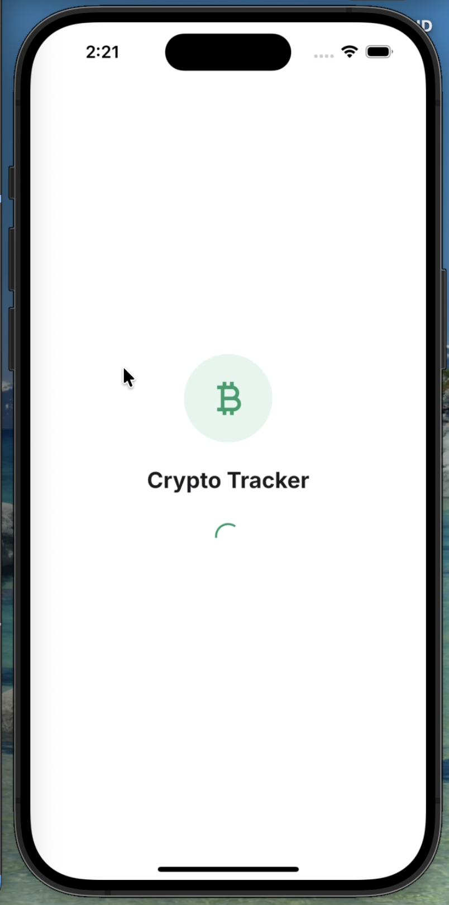
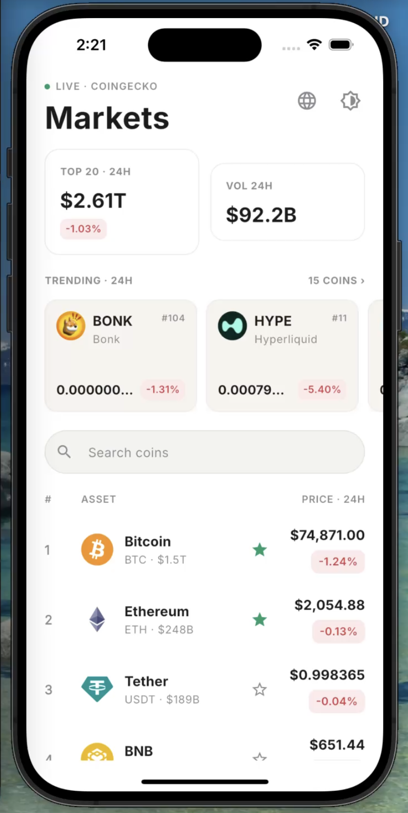
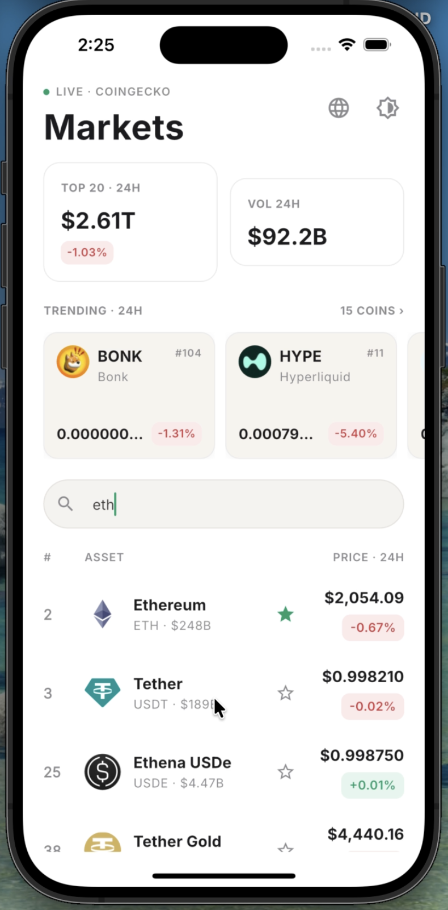
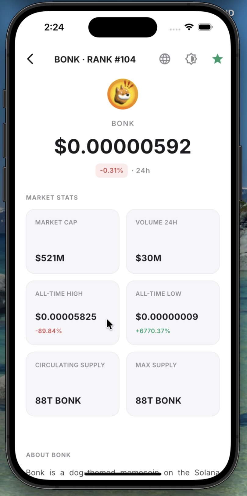
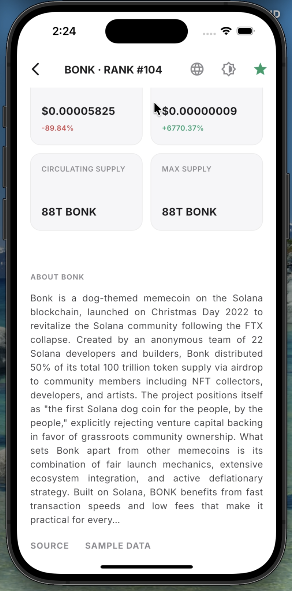
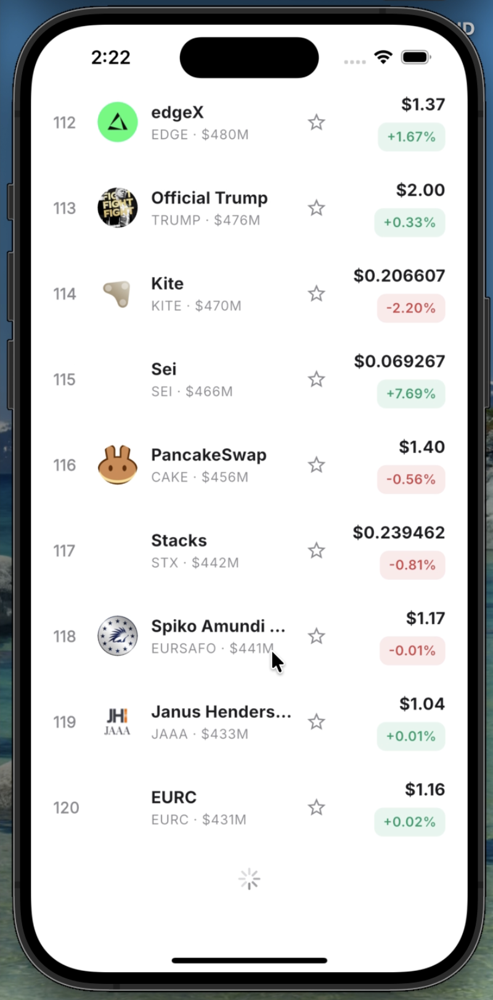

### Error and offline UX

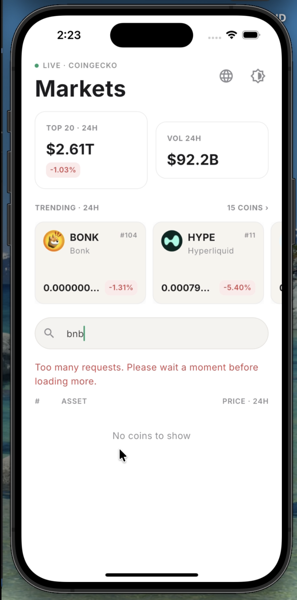

### Theme and localization

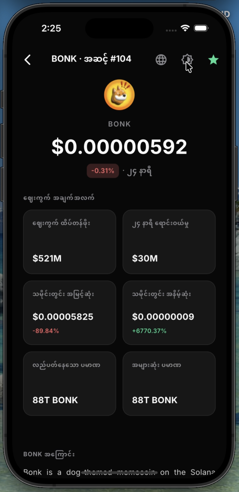
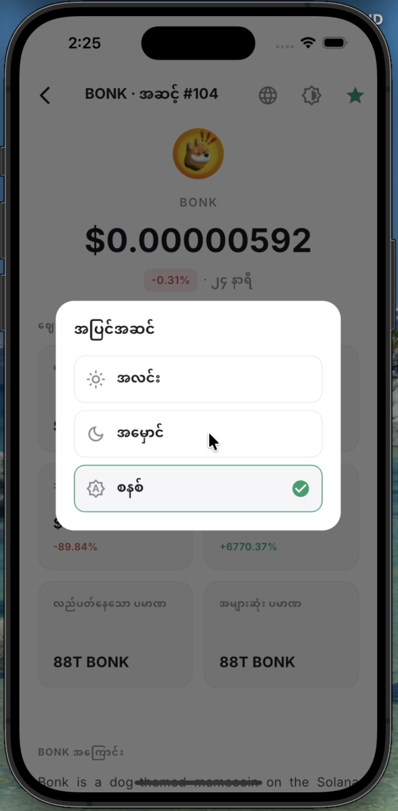
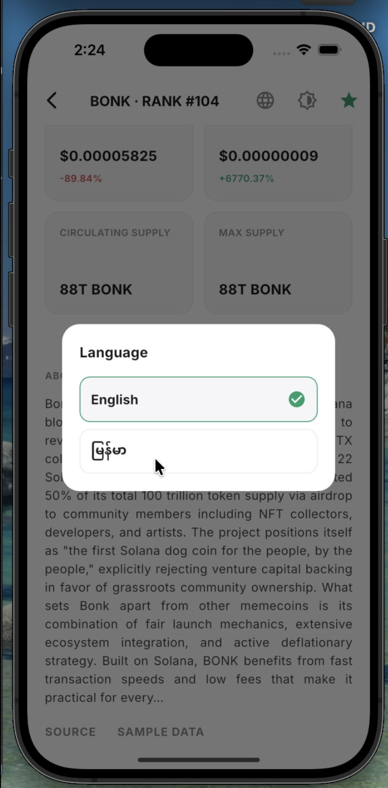
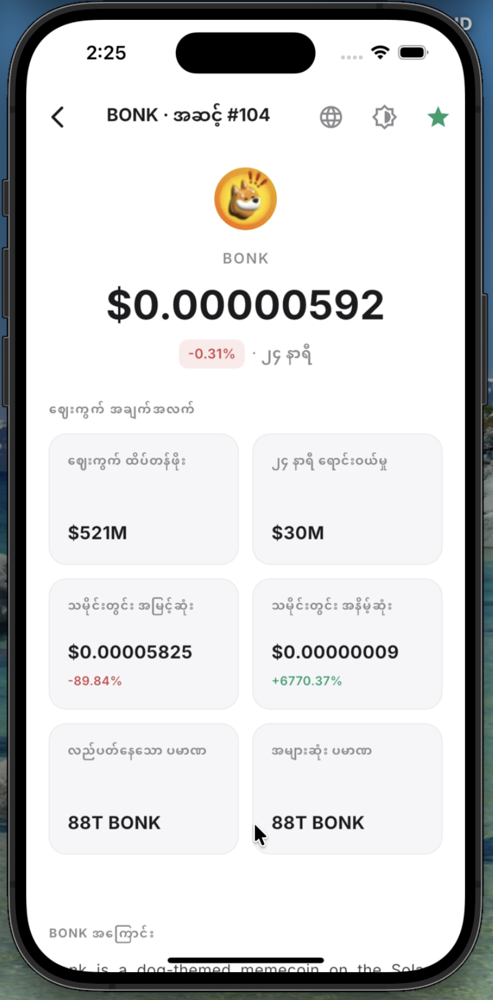

